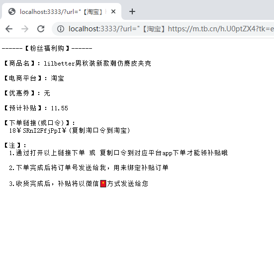

# 淘宝、京东、拼多多转链服务
* ../config/index.js 文件 配置你的联盟平台返利key secret
* 启动服务：
```
    npm i
    npm run server
```
* 使用：
  * 请求地址：http://127.0.0.1:3333?url='淘宝、京东、拼多多复制的商品链接（只要包含链接内容即可，无需提取出https://****.com链接）' 如：'【淘宝】https://m.tb.cn/h.U0ptZX4?tk=eCtH2FfjT0a CZ0001 「Lilbetter仿麂皮夹克男秋装新款男装美式上衣休闲工装秋季外套潮」
点击链接直接打开'
  * 示例：  
  